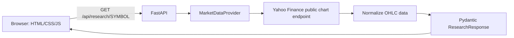

# Financial Research Assistant

A small, explainable web application for market research. Enter a symbol such as `AAPL`, `NVDA`, or `XAUUSD`; the browser calls a FastAPI endpoint, which fetches, normalizes, validates, and returns recent market data. It is a research tool, **not** a trading bot: it does not issue Buy/Sell signals or price targets.

## Demo

Run the server and open `http://127.0.0.1:8000`. The FastAPI interactive docs are at `/docs`.


## Features

- Latest available price and percentage change
- Five recent daily OHLC candles
- Deterministic, descriptive market summary
- Public JSON API with Pydantic response validation
- Safe errors for invalid symbols, timeouts, and rate limits
- `XAUUSD` maps explicitly to Yahoo Finance's `XAUUSD=X` when the provider makes it available

## Architecture and data flow



`YahooProvider` was selected because its public chart endpoint works without an API key for a learning V1 and supports common equities. It is an external, unofficially stable dependency: availability and rate limits can change. The small `MarketDataProvider` interface makes replacement straightforward. V1 needs no API key; `.env.example` reserves a future LLM configuration location.

## Tech stack

Python, FastAPI, Uvicorn, Pydantic, HTTPX, pytest, HTML, CSS, and vanilla JavaScript.

## API endpoints

| Endpoint | Purpose |
| --- | --- |
| `GET /health` | Confirm the server is running |
| `GET /api/research/{symbol}` | Return validated research JSON |

Errors use a safe `{detail, code}` body. The app distinguishes invalid symbols (400), provider failure (502), and provider rate limit (503).

## How to run

```powershell
python -m venv .venv
.\.venv\Scripts\Activate.ps1
pip install -r requirements.txt
uvicorn backend.main:app --reload
```

Then open `http://127.0.0.1:8000`. If Windows does not recognize `python`, install Python 3.11+ and reopen the terminal. In this Codex workspace, use the supplied Python runtime instead.

## Testing

```powershell
pytest
ruff check .
```

The tests cover the health endpoint and schema creation through a fake provider (so unit tests do not depend on external market availability). Use the browser/API requests for the live integration check.

When this repository is published on GitHub, `.github/workflows/ci.yml` runs the same lint and test checks for every push and pull request. This keeps the small V1 honest without adding a heavy deployment stack.

## Project structure

```text
backend/       FastAPI app, schemas, provider, service
frontend/      Browser UI
tests/         Fast unit tests
docs/          tutorial, resume notes, verified screenshots
```

## Limitations

- Latest values depend on the provider and can be delayed, unavailable, or rate-limited.
- Yahoo ticker conventions vary; `XAUUSD` is explicitly mapped but should be treated as an FX reference, not a guaranteed spot feed.
- No news, citations, LLM analysis, authentication, persistence, or trading functionality.

## Future work

- V2: optional LLM API, inserted behind the existing summary function.
- V3: financial news with source citations.
- V4: Prompt Lab for research prompts.
- V5: prompt version comparison.
- V6: AI response schema validation.

## Learning and design decisions

The app deliberately favors readable functions over frameworks and elaborate patterns. Provider output is normalized before `ResearchResponse` validation, so the frontend receives one stable shape even if provider payload details differ.

