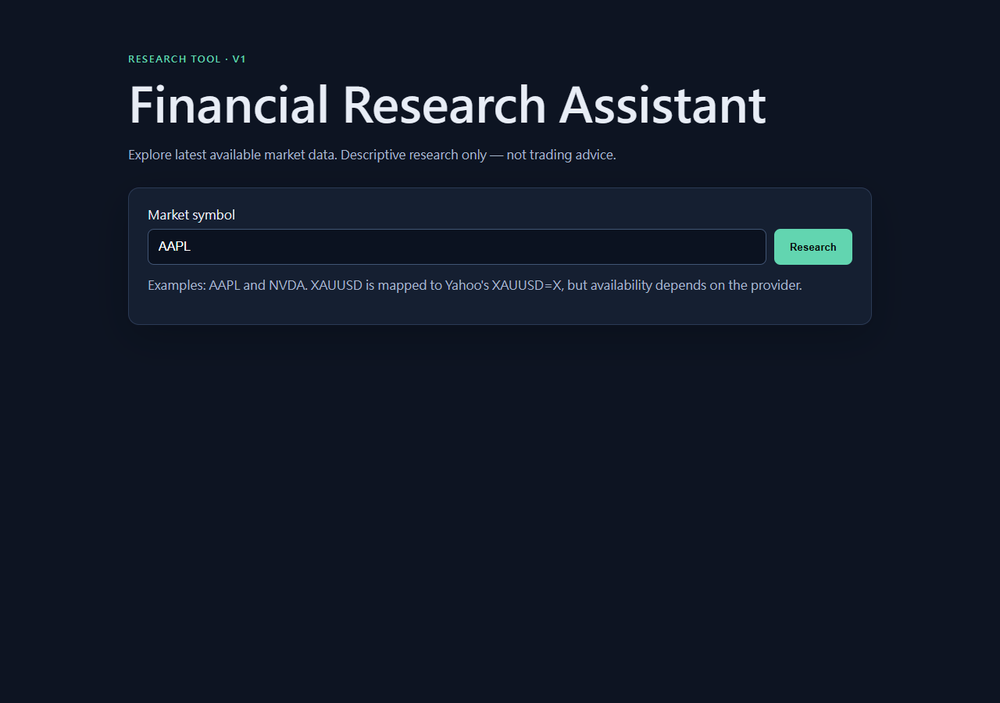
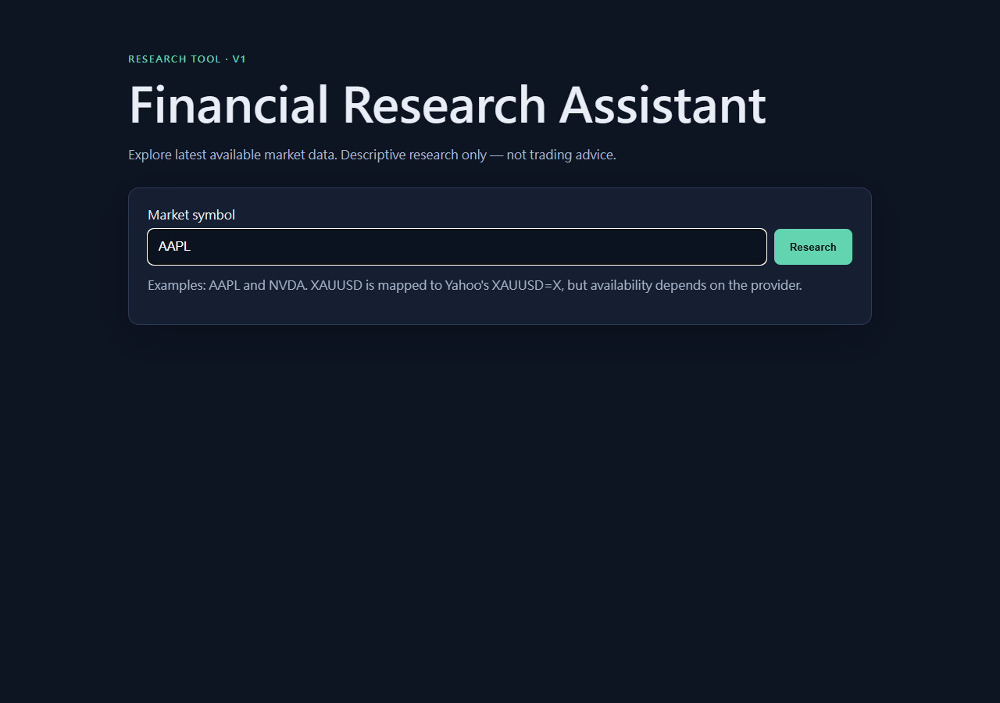
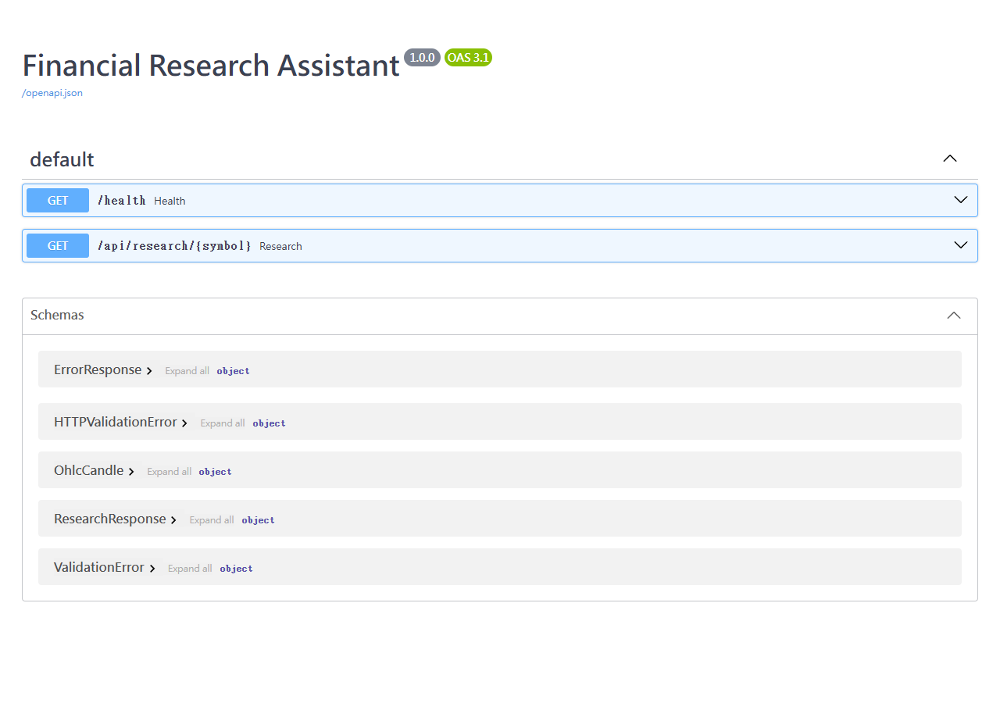
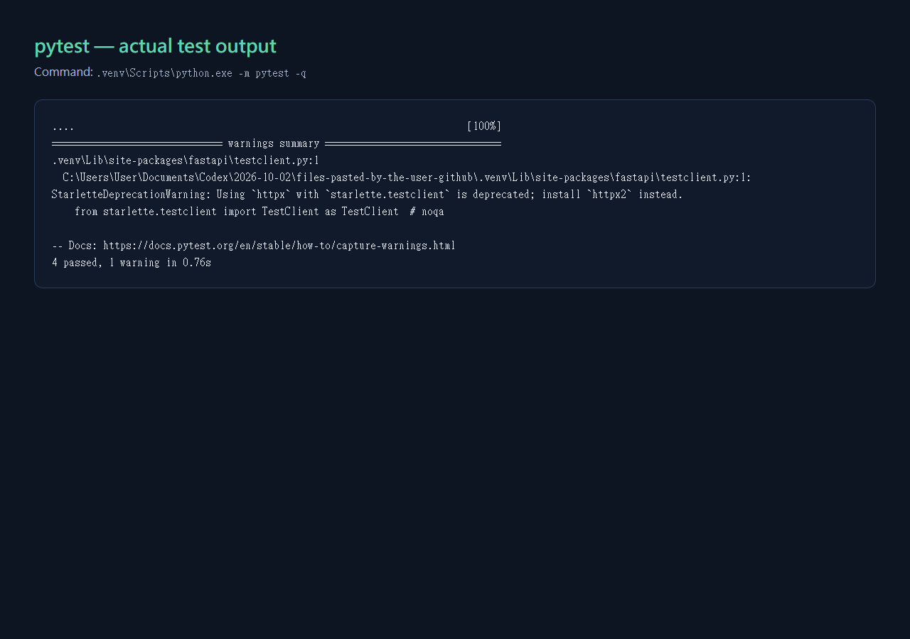

# From zero: rebuild Financial Research Assistant

This is a guided rebuild of the reference project. Read it with the project open beside you; type small pieces yourself after you understand them.

## Real reference screenshots










## Step 0 — What we are building

**What:** A webpage asks our Python API for market research.  
**Why:** This cleanly separates the screen from data retrieval.  
**Flow:** `Browser → JavaScript fetch → FastAPI endpoint → provider → normalize → Pydantic validation → JSON → browser`.

`GET` means “ask a server for data.” An endpoint is a URL handled by backend code. JSON is a text format that both JavaScript and Python can exchange.

### Checkpoint

Q: What is the difference between frontend and backend?
<details><summary>View answer</summary>The frontend runs in the browser and displays/interacts. The backend runs Python and owns the API/data workflow.</details>

## Step 1 — Create folders and environment

**What:** Create the structure shown in `README.md`, then a private Python environment.  
**Why:** A virtual environment keeps this project's packages separate.  
**Files:** root, `backend/`, `frontend/`, `tests/`, `docs/`.

```powershell
mkdir financial-research-assistant; cd financial-research-assistant
python -m venv .venv
.\.venv\Scripts\Activate.ps1
pip install -r requirements.txt
```

You should see `(.venv)` in the terminal. If PowerShell blocks activation, open a normal Command Prompt or ask your system administrator; do not disable security settings casually.

## Step 2 — First FastAPI endpoint

**What:** Start with `backend/main.py` and `/health`.  
**Why:** Test the server before adding external data.

```python
@app.get("/health")
async def health() -> dict[str, str]:
    return {"status": "ok"}
```

`@app.get` connects a URL to the following function. `async` lets the server wait for network work without blocking other requests. Run `uvicorn backend.main:app --reload`, then visit `/health`; you should see `{"status":"ok"}`.

**Interview question:** Why make a health endpoint?  
**Answer:** It separates “is my server running?” from harder provider problems.

## Step 3 — Build the HTML and JavaScript request

**What:** `frontend/index.html` contains an input, button, result cards, and table; `app.js` responds to a click.  
**Why:** HTML gives structure, CSS gives presentation, and JavaScript makes the HTTP request.

```js
const response = await fetch(`/api/research/${encodeURIComponent(symbol)}`);
const payload = await response.json();
```

`fetch()` asks the browser to make a request. `await` waits without freezing the page. `encodeURIComponent` makes input safe to place in a URL. `response.json()` converts JSON text into a JavaScript object. The UI checks `response.ok` so errors become readable text.


The backend serves this frontend from the same `http://127.0.0.1:8000` origin. That avoids a beginner-unfriendly CORS configuration.

### Checkpoint

Q1: What is `fetch()` responsible for?  
Q2: Why should an API key not go in JavaScript?
<details><summary>View answers</summary>Q1: Sending the browser's HTTP request and receiving its response. Q2: Anyone can inspect browser-delivered JavaScript, so secrets would be exposed.</details>

## Step 4 — Add the market-data provider

**What:** Read `backend/providers/base.py` first, then `market_data.py`.  
**Why:** The base interface says every provider must return a normalized `MarketSnapshot`; Yahoo-specific URL/JSON details stay in one file.

Yahoo returns timestamps plus parallel arrays such as `open`, `high`, `low`, and `close`. The loop joins index 0 with index 0, index 1 with index 1, and creates readable candle dictionaries. It skips incomplete candles and needs at least two values to calculate a comparison.

`XAUUSD` is mapped to `XAUUSD=X` in `SYMBOL_ALIASES`; this is a provider convention, not a universal finance rule. If Yahoo returns no data for it, the UI intentionally reports an unavailable-symbol error rather than substituting a different gold instrument.

**Run:** visit `/api/research/AAPL` or `/docs` and use “Try it out.”  
**Expected:** A JSON object with `price`, `change_percent`, `ohlc`, `summary`, `source`, and UTC `fetched_at`. `fetched_at` means when this app retrieved the provider response; it is not a claim about the market's own last-update timestamp.


## Step 5 — Normalize, validate, and summarize

**What:** `services/research.py` calculates the change and builds `ResearchResponse`.  
**Why:** External APIs are not our contract. Our schema is.

```python
ohlc = [OhlcCandle(**candle) for candle in snapshot.candles]
return ResearchResponse(symbol=snapshot.requested_symbol, ohlc=ohlc, ...)
```

Pydantic validates fields at this boundary. If, for example, a candle has text where a number is expected, validation fails here instead of silently confusing the browser. The template summary is deliberately deterministic. A future LLM belongs behind `build_market_summary`, after trusted data is already normalized.

### Checkpoint

Q1: Which layers handle a symbol?  
Q2: Why use Pydantic?
<details><summary>View answers</summary>Q1: Route validation → provider fetch/normalization → service calculation → schema → frontend. Q2: It makes one typed, checked API contract instead of passing arbitrary provider JSON to the UI.</details>

## Step 6 — Error handling

**What:** `ProviderError` represents expected provider failures.  
**Why:** A visitor should see “symbol unavailable” or “try again later,” not a Python traceback.

Try a clearly nonexistent symbol, e.g. `/api/research/NOTAREALMARKET123`. The backend maps errors to 400, 502, or 503. The JavaScript `catch` displays the server message.


## Step 7 — Test it

**What:** Run `pytest`.  
**Why:** `tests/test_health.py` verifies the server's basic contract; `test_research_schema.py` uses a fake provider to test response construction without live-network randomness.

```powershell
pytest
```

Expected: all tests pass. Then do a separate live check: `/health`, `/api/research/AAPL`, invalid symbol, and click **Research** in the browser.

### Checkpoint

Q: Why not depend on Yahoo in every unit test?
<details><summary>View answer</summary>A provider can be offline or rate-limited; a fake provider makes a unit test deterministic. Live testing checks the integration separately.</details>

## Step 8 — Git and GitHub

**What:** Track code and publish it; do not publish secrets.  
**Why:** Git provides history and GitHub lets interviewers inspect the project.

```powershell
git init
git add .
git status
git commit -m "Build Financial Research Assistant V1"
```

Read `git status` before every commit. `.gitignore` excludes `.env` and `.venv`. Copy `.env.example` to `.env` only when a later feature needs a key; never commit the real file.

**Interview question:** What design choice are you proud of?  
**Answer:** I kept the provider replaceable and the browser contract validated, while resisting the temptation to claim it provides trading signals.

## Suggested first-day practice

1. Run the reference project unchanged and call `/health`.
2. Trace one AAPL request in `app.js`, `main.py`, `market_data.py`, and `research.py`.
3. Change only the page subtitle, rerun it, and commit that small change.

